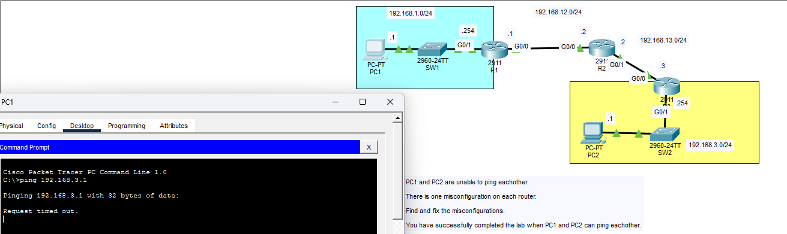
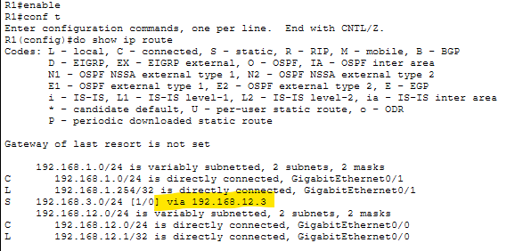
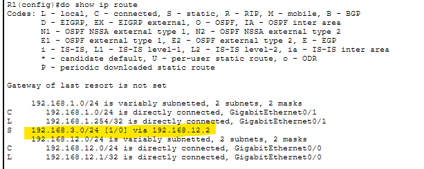
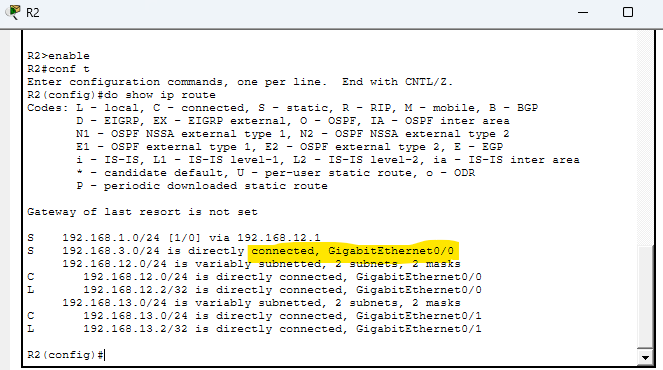
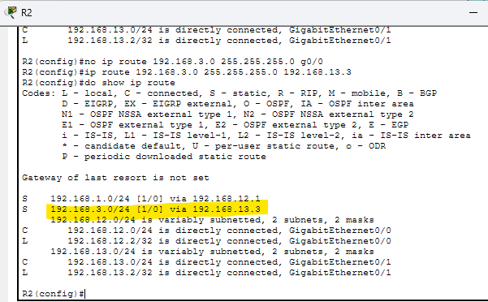
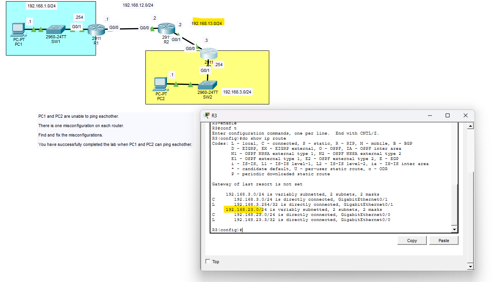
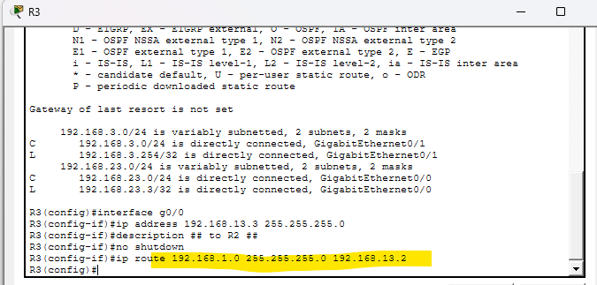
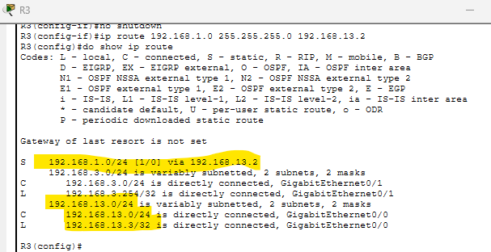
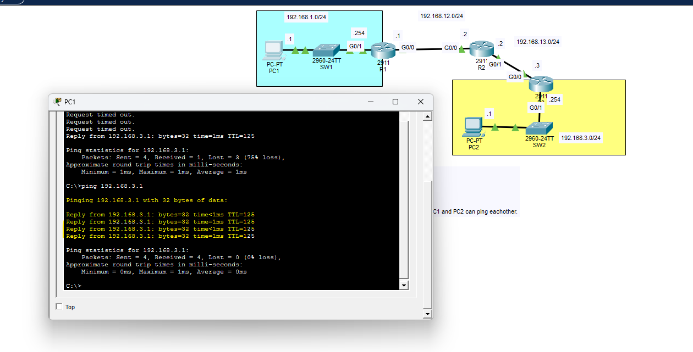

# 🔧 Intermittent Network Connectivity Troubleshooting

### 📡 Static Routing Lab | Cisco Packet Tracer

<p align="right">
  <b>🧑‍💻 Christopher Lee</b><br>
  Aspiring Network / Cybersecurity Professional
</p>

---

## 📌 Overview

This lab simulates a real-world troubleshooting scenario where two hosts are unable to communicate due to multiple routing misconfigurations across routers.

The objective was to:

* Diagnose intermittent connectivity issues
* Analyze routing tables using Cisco CLI
* Identify incorrect static routes
* Restore full end-to-end connectivity

---

## 🖥️ Network Topology



* PC1 → R1 → R2 → R3 → PC2
* Networks:

  * 192.168.1.0/24
  * 192.168.12.0/24
  * 192.168.13.0/24
  * 192.168.3.0/24

---

## 🚨 Problem

Initial ping results showed intermittent connectivity:


```bash
Reply from 192.168.3.1
Request timed out
Request timed out
Request timed out

Packets: Sent = 4, Received = 1, Lost = 3 (75% loss)
```

---

## 🔍 Investigation & Troubleshooting

---

### 🔹 R1 Misconfiguration



```bash
ip route 192.168.3.0 255.255.255.0 192.168.12.3
```

#### ✅ Fix


```bash
no ip route 192.168.3.0 255.255.255.0 192.168.12.3
ip route 192.168.3.0 255.255.255.0 192.168.12.2
```

#### ✔ Verification



---

### 🔹 R2 Misconfiguration



```bash
ip route 192.168.3.0 255.255.255.0 g0/0
```

#### ✅ Fix


```bash
no ip route 192.168.3.0 255.255.255.0 g0/0
ip route 192.168.3.0 255.255.255.0 192.168.13.3
```

#### ✔ Verification



---

### 🔹 R3 Misconfiguration



Issues identified:

* Interface misconfiguration
* Missing static route

#### ✅ Fix Interface


```bash
interface g0/0
ip address 192.168.13.3 255.255.255.0
no shutdown
```

#### ✅ Add Static Route



```bash
ip route 192.168.1.0 255.255.255.0 192.168.13.2
```

#### ✔ Verification



---

## ✅ Final Verification



```bash
Packets: Sent = 4, Received = 4, Lost = 0 (0% loss)
```

✔ Full connectivity restored between PC1 and PC2

---

## 🧠 Key Takeaways

* Incorrect static routes can cause **intermittent packet loss**
* Routers may perform **load balancing across invalid paths**
* Always pref*
