# Lab 01 — Inter-VLAN Routing (Router-on-a-Stick)

## Overview

This lab demonstrates how to configure VLAN segmentation and enable communication between VLANs using **Router-on-a-Stick**.

Router-on-a-Stick is a common enterprise networking design where a router provides Layer 3 routing for multiple VLANs over a single trunk link.

In this lab we:

* Built a small network in Cisco Packet Tracer
* Created VLANs on a switch
* Assigned switch ports to VLANs
* Configured a trunk link between switch and router
* Created router subinterfaces
* Enabled inter-VLAN routing
* Troubleshot connectivity issues

---

# Network Topology

Devices used:

* Cisco 1941 Router
* Cisco 2960 Switch
* 2 PCs
* Cisco Packet Tracer

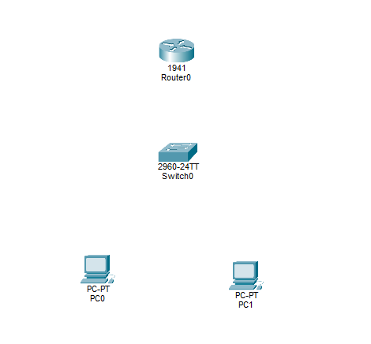

---

# Step 1 — Connect Devices

All devices were connected using copper straight-through cables.

Router → Switch → PCs

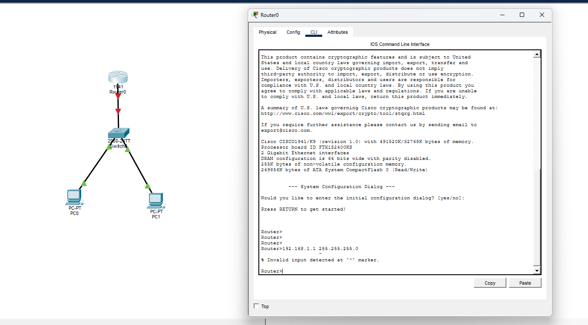

---

# Step 2 — Access Router CLI

Administrative mode was enabled on the router.

```
enable
configure terminal
```

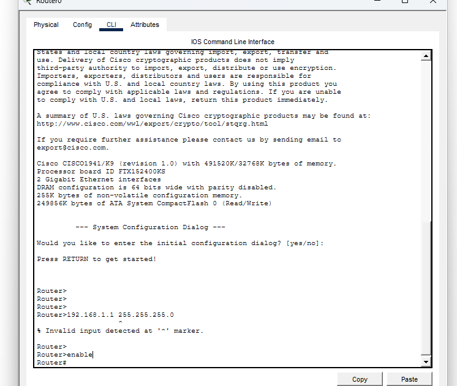

---

# Step 3 — Configure Router Interface

The router interface connected to the switch was enabled.

```
interface gigabitethernet0/0
no shutdown
```

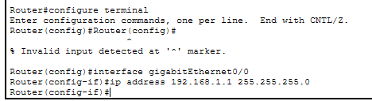

---

# Step 4 — Configure PC IP Addresses

PC0

```
IP Address: 192.168.10.10
Subnet Mask: 255.255.255.0
Gateway: 192.168.10.1
```

PC1

```
IP Address: 192.168.20.10
Subnet Mask: 255.255.255.0
Gateway: 192.168.20.1
```

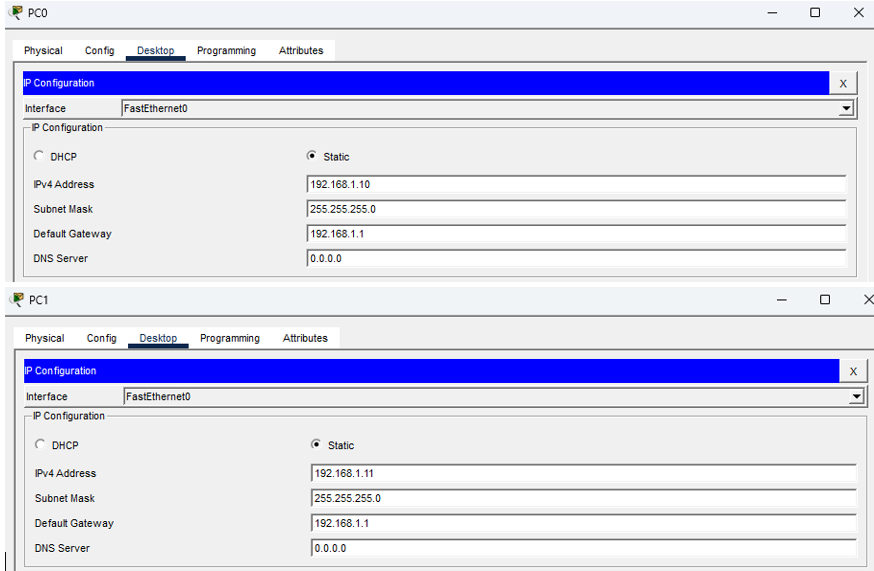

---

# Step 5 — Verify Initial Connectivity

Before VLAN segmentation, devices were able to communicate.

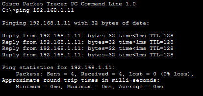

---

# Step 6 — Create VLANs

Two VLANs were created on the switch.

```
vlan 10
name SALES

vlan 20
name SUPPORT
```

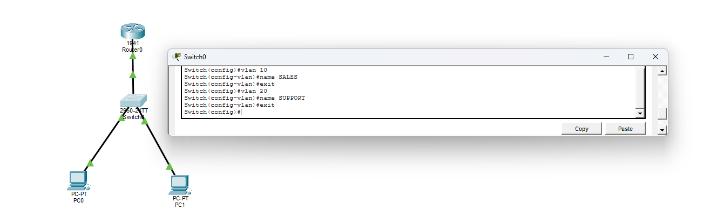

---

# Step 7 — Assign Switch Ports

Access ports were assigned to their respective VLANs.

```
interface FastEthernet0/1
switchport mode access
switchport access vlan 10

interface FastEthernet0/2
switchport mode access
switchport access vlan 20
```

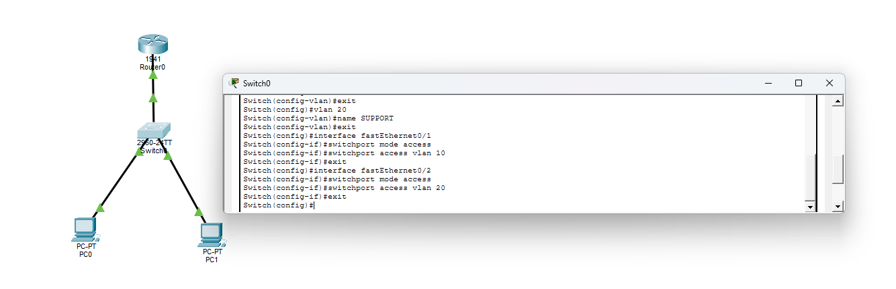

---

# Step 8 — VLAN Isolation

After VLAN segmentation, devices in different VLANs could no longer communicate.

This behavior is expected because VLANs isolate Layer 2 traffic.

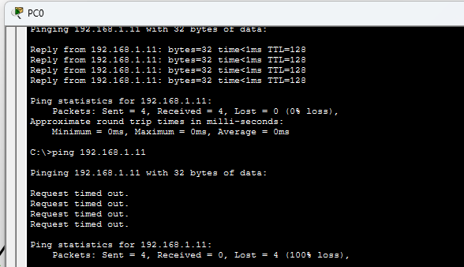

---

# Step 9 — Verify VLAN Configuration

```
show vlan brief
```

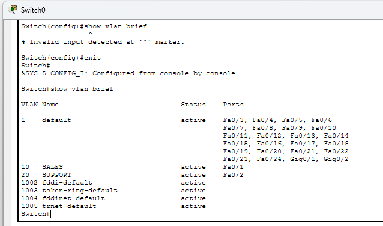

---

# Step 10 — Configure Trunk Port

The switch port connected to the router was configured as a trunk.

```
interface GigabitEthernet0/1
switchport mode trunk
```

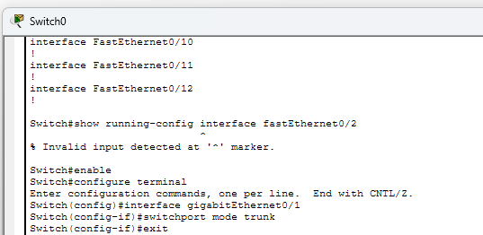

---

# Step 11 — Configure Router Subinterfaces

Router subinterfaces were created for VLAN routing.

```
interface GigabitEthernet0/0.10
encapsulation dot1Q 10
ip address 192.168.10.1 255.255.255.0

interface GigabitEthernet0/0.20
encapsulation dot1Q 20
ip address 192.168.20.1 255.255.255.0
```

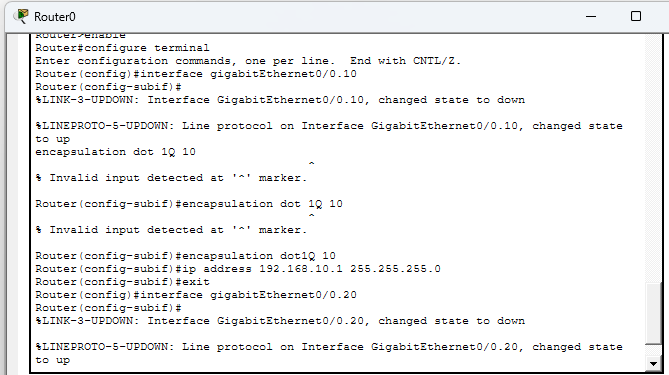

---

# Troubleshooting

Several troubleshooting steps were performed during configuration:

* Verified router interfaces
* Checked VLAN assignments
* Confirmed trunk configuration
* Corrected router interface configuration

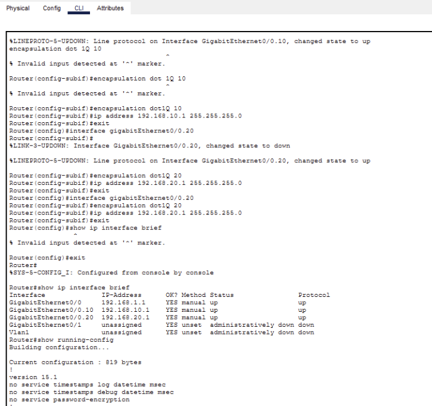

---

# Final Verification

After correcting the configuration, inter-VLAN routing was successful.

Devices in VLAN10 and VLAN20 were able to communicate.

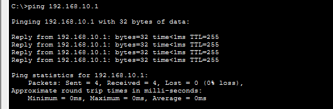

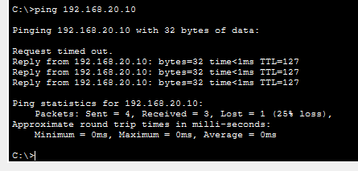

---

# Networking Concepts Demonstrated

This lab demonstrates several important networking fundamentals:

* VLAN segmentation
* Access ports
* Trunk ports
* 802.1Q tagging
* Router-on-a-Stick
* Inter-VLAN routing
* Network troubleshooting

---

# Commands Used

Switch

```
show vlan brief
show running-config
show interfaces trunk
```

Router

```
show ip interface brief
show running-config
```

---

# Skills Demonstrated

* VLAN configuration
* Layer 2 switching
* Inter-VLAN routing
* Router subinterfaces
* Network troubleshooting
* Cisco Packet Tracer simulation
