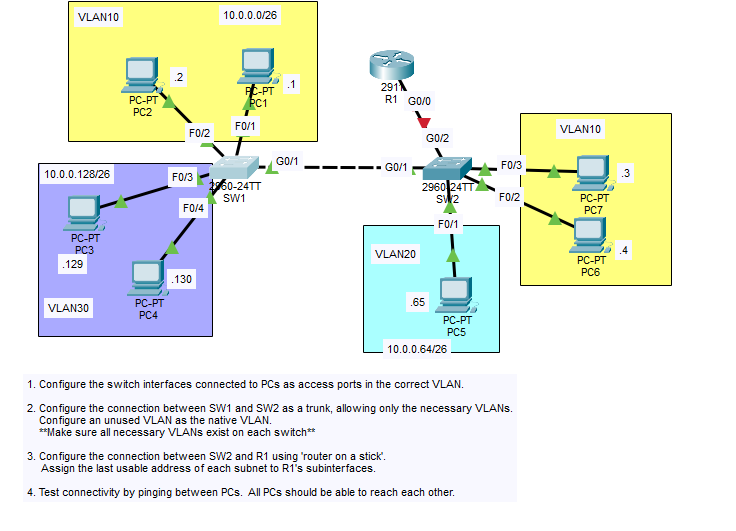
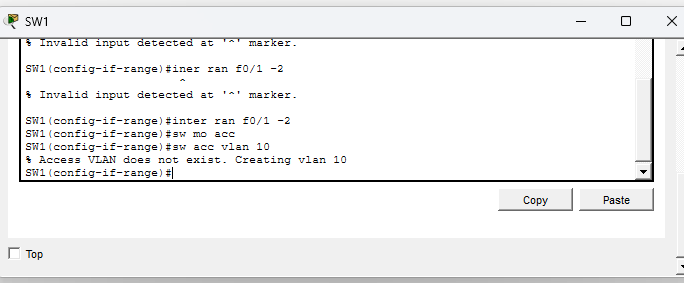
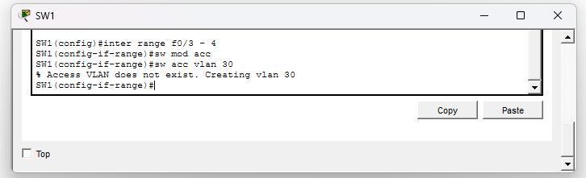
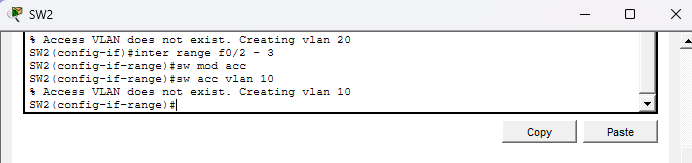
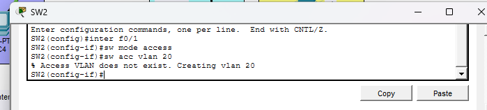
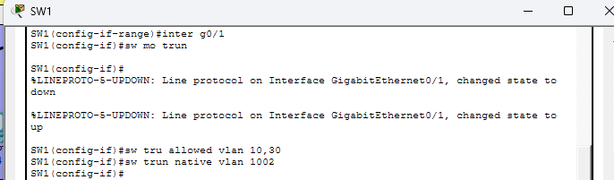
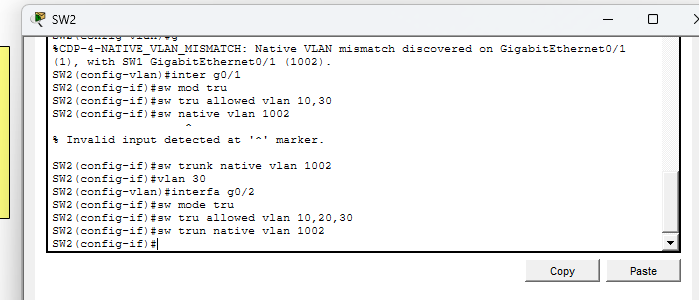

# 🔐 Inter-VLAN Routing Lab (ROAS + Trunking)

## 📌 Overview

This lab demonstrates **Inter-VLAN Routing using Router-on-a-Stick (ROAS)** across two switches.

---

## 🖥️ Topology

[](screenshots/01_Topology.png)

---

## ⚙️ Step 1 – Configure Access Ports

### SW1

```bash id="a1111"
interface range f0/1-2
switchport mode access
switchport access vlan 10

interface range f0/3-4
switchport mode access
switchport access vlan 30
```

[](screenshots/02_create_vlan10_sw1.png)
[](screenshots/02_create_vlan30_sw1.png)

---

### SW2

```bash id="b2222"
interface range f0/2-3
switchport mode access
switchport access vlan 10

interface f0/1
switchport mode access
switchport access vlan 20
```

[](screenshots/02_create_vlan10_sw2.png)
[](screenshots/02_create_vlan20_sw2.png)

---

## 🔗 Step 2 – Configure Trunks

### SW1

```bash id="c3333"
interface g0/1
switchport mode trunk
switchport trunk allowed vlan 10,20,30
switchport trunk native vlan 1002
```

[](screenshots/03_sw1_g1_trunk_native_vlan.png)

---

### SW2 (to SW1)

```bash id="d4444"
interface g0/1
switchport mode trunk
switchport trunk allowed vlan 10,20,30
switchport trunk native vlan 1002
```

[](screenshots/03_sw2_g1_trunk_native_vlan_vlan30.png)

---

### SW2 (to Router)

```bash id="e5555"
interface g0/2
switchport mode trunk
switchport trunk allowed vlan 10,20,30
switchport trunk native vlan 1002
```

[](screenshots/03_sw2_g2_trunk_native_vlan_.png)

---

## 🌐 Step 3 – Router-on-a-Stick

```bash id="f6666"
interface g0/0
no shutdown

interface g0/0.10
encapsulation dot1q 10
ip address 10.0.0.62 255.255.255.192

interface g0/0.20
encapsulation dot1q 20
ip address 10.0.0.126 255.255.255.192

interface g0/0.30
encapsula
```
